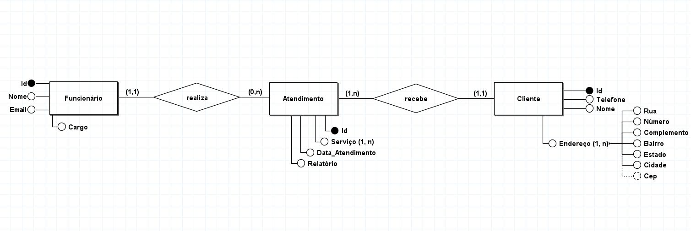

<h1 align="center">📊 Sistema de Controle de Atendimentos</h1>

   

 
    <h3>✅ Objetivo</h3>
    
Construir um sistema que respeite as <a href="https://github.com/filipe-rds/Projeto2_BD2/blob/main/assets/Roteiro%20para%20Miniprojeto%20de%20BD%20baseado%20em%20Documentos.pdf">regras de negócio</a> estabelecidas previamente para o projeto.

 
    <h3>💻 Tecnologias e Ferramentas </h3>
    
    

 
  <h3>👨‍💻 Desenvolvedores</h3>
  Cibele Gomes Domingos Moraes Lima

 
    <h3>📚 Tecnologias</h3>
    
<strong>MongoDB</strong>: MongoDB é um banco de dados NoSQL orientado a documentos. Ele armazena dados em documentos JSON flexíveis, permitindo a modelagem eficiente de dados hierárquicos e complexos. Neste projeto, utilizei o MongoDB para criar e gerenciar documentos, proporcionando uma maneira robusta de lidar com dados não estruturados.

 
    <h3>🎯 Experiência</h3>
    
Realizei a criação de documentos no MongoDB para o sistema de controle de atendimentos. Foi uma experiência enriquecedora trabalhar com a documentação NoSQL, pois permite uma flexibilidade maior na estruturação dos dados, facilitando a adaptação às mudanças nas necessidades do projeto. Gostei muito da experiência de criar e manipular documentos no MongoDB, aprimorando minha compreensão e habilidades no uso de bancos de dados NoSQL.

